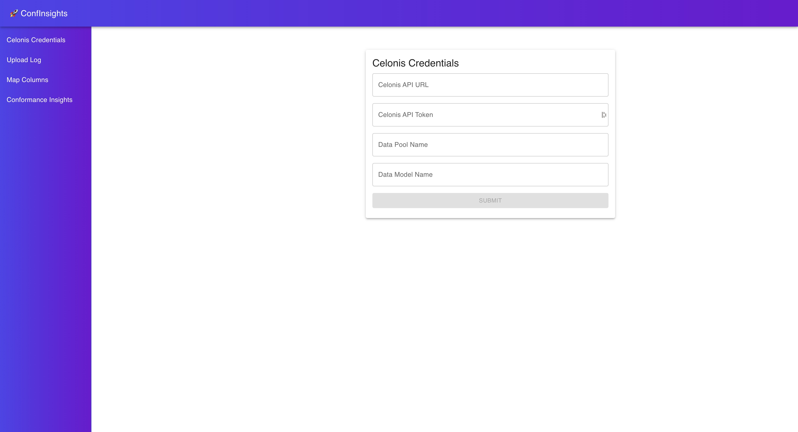
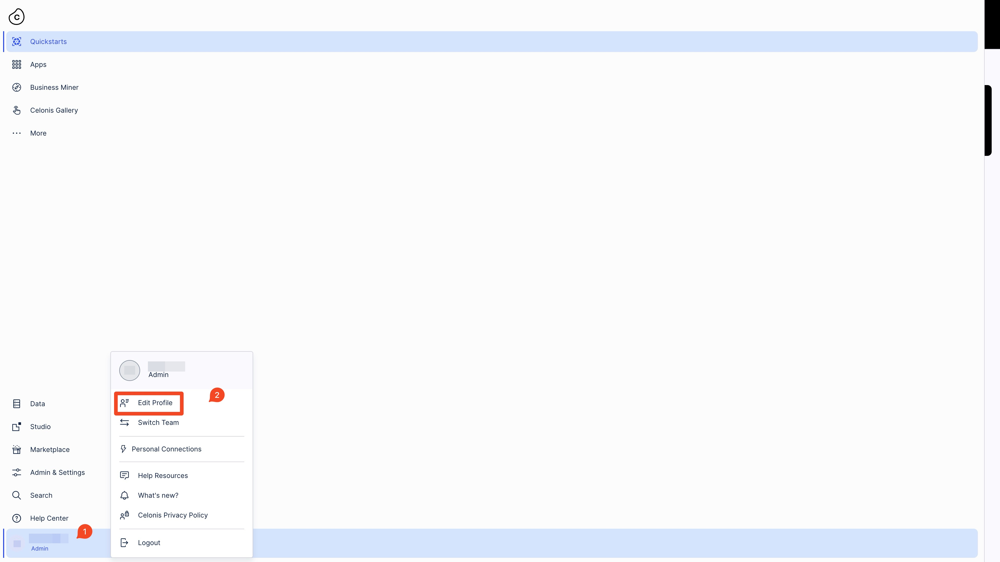
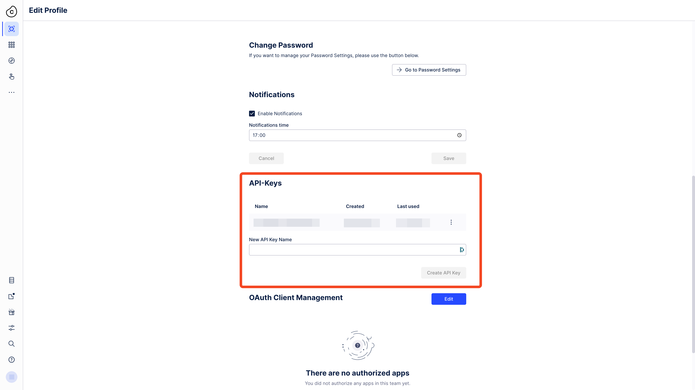
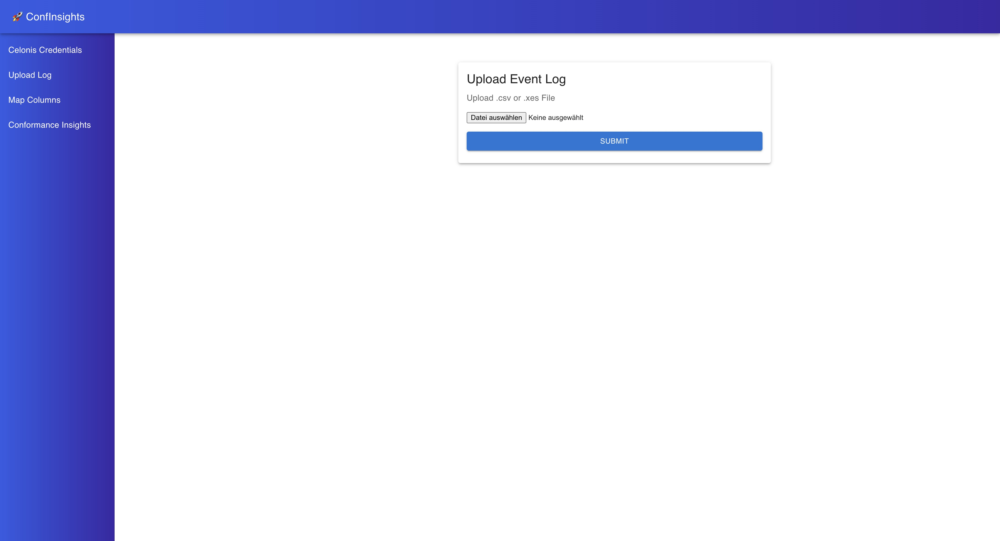
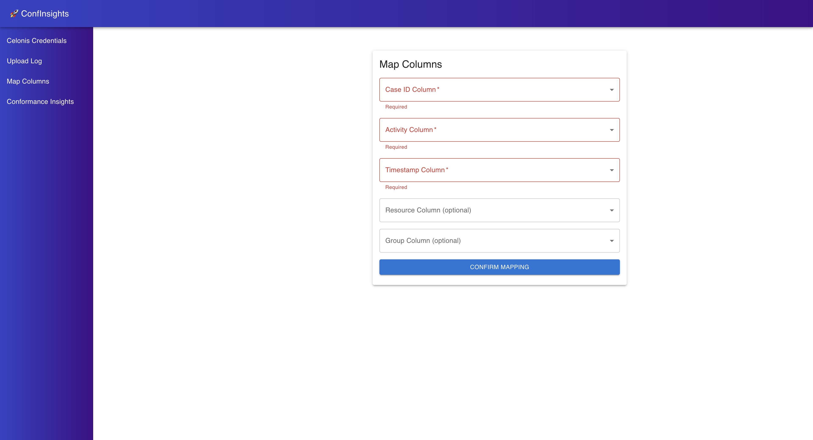
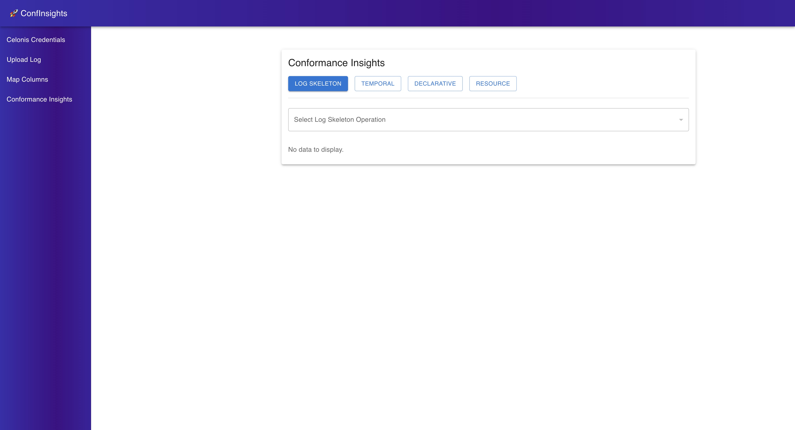

Usage
=====

This page explains how to use the application after installation.

.. important::

  You need a Celonis account to use the application.

Adding Celonis Credentials
--------------------------

The first page you will see after starting the application in your browser is the **Celonis Credentials** page.

Here you you need to enter your Celonis credentials.
In the following we explain how to obtain these credentials.

Celonis API URL
^^^^^^^^^^^^^^^

You need access to the Celonis Academic programm to obtain the ``API URL``.
When you are logged in to the Celonis platform you can copy your ``API URL`` from the URL bar of your browser.
It should look something like this:

``https://academic-celonis-<something-unique>.celonis.cloud/``

Celonis API Token
^^^^^^^^^^^^^^^^^

To obtain your ``API Token``, you need to log in to the Celonis platform and navigate to the your account settings section.
You find it in the bottom of the left sidebar.
Then you have to click on "Edit Profile".

Then you need to scroll down to the **API-Keys** section.

There you can create a new ``API Token`` that you can copy and paste into the application.

.. note::

  Maybe store it somewhere safe, so you can use it again later.

Data Model and Data Pool Name
^^^^^^^^^^^^^^^^^^^^^^^^^^^^^

Here you can choose names you like for your Data Model and Data Pool.
These names will be used to store the data you upload in the Celonis platform.

Uploading an Event Log
----------------------

The next page you will see is the **Upload Event Log** page.

Here you can upload your event log in ``CSV`` or ``XES`` format.

Mapping the Event Log Columns
^^^^^^^^^^^^^^^^^^^^^^^^^^^^^

After you uploaded your event log, you will be redirected to the **Map Event Log Columns** page.

Here you need to map the columns of your event log to the required columns for the conformance checking techniques.
The required columns are:

* **Case ID**: The unique identifier for each case in the event log.
* **Activity**: The activity that was performed in the case.
* **Timestamp**: The timestamp of the activity in the case.

Optionally, you can also map the following columns:

* **Resource**: The resource that performed the activity in the case (if applicable).
* **Group**: The Group that the resource belongs to (if applicable).

.. note::

  Note that you need to map the Resource column in order to use the resource-based conformance checking techniques.
  If you do not have a Resource column in your event log, you can leave it empty.

Conformance Checking Insights
-----------------------------

The last page you see is the **Conformance Checking Insights** page.
This is the main page of the application, where you can see the results of the different conformance checking techniques.

Here you can select different conformance checking techniques.
For each technique you can select different aspects to analyze.

For an indepth explanation of the different conformance checking techniques, please refer to the :doc:`conformance_checking` page.